# Shy Dog-Owners Club

Welcome to my first project for [Code Institute](https://codeinstitute.net)!

[Click me](https://krystalcoding.github.io/antisocial-dog-meetups/) to preview my website with fully interactive design.

The Shy Dog-Owners Club is a community site for people in Uppsala, Sweden who own shy or socially anxious dogs. The Club offers different settings for meetups where the owners can mingle while their dogs keep comfortable distance from one another.

Users of this web page will be able to find all the information they need about the club ethos, meeting times and places, pictures for inspiration, and a sign up form to aid in the community organization.

## Features
- Navigation
    - At the top of the pages, the navigation bar displays h1 text on the left side. SHY DOG-OWNERS CLUB on the home page, GET SOCIAL on the images page, and SIGN UP FOR MEETUPS on the sign-up page all link to the top of the home page.
    - At the top of the pages, the navigation bar shows other navigation links on the right side. Home, Images, Sign Up all link to their associated sections on the same site.
    - The navigation text are in Lato and Oswald fonts, and the color contrasts with the background.
    - The navigation displays the Club name and info about the page the user is on, and makes navigating the information intuitive.

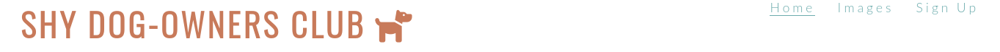
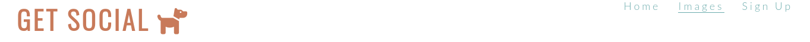
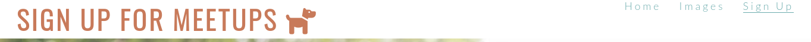

- The Banner
    - The banner displays the purpose of the club, which is to meet up with other dog owners, and continues with the color scheme and fonts.
    - The banner advertises the locations in which the meet ups are to be held.

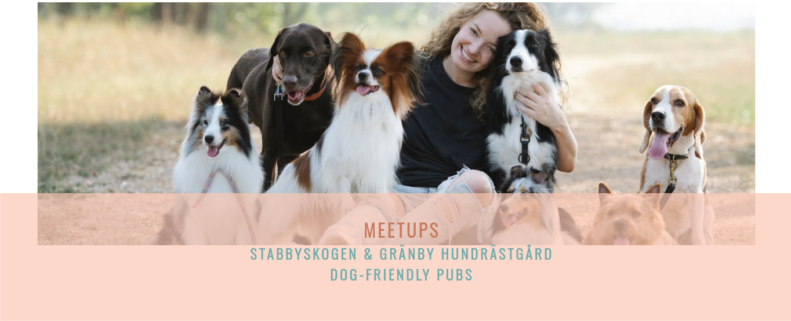

- Club Ethos
    - The ethos section displays the purpose and aspirations of the club, answering its own question: WHY SOCIAL SETTINGS FOR ANTISOCIAL DOGS?
    -The four sections of the ethos display as follows: COMMUNITY, GET ACTIVE, MINDSET, GET SOCIAL. These each explain in detail the purpose and benefits of joining such a community club.

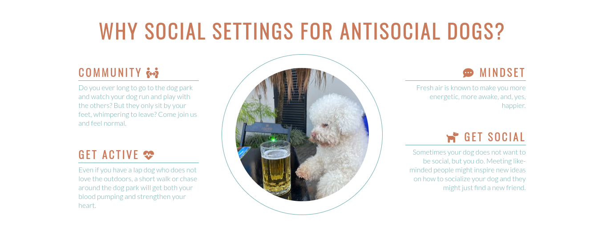

- Logistics
    - At the bottom of the home page, there are 5 sections containing information about meet up times and locations.
    - The three types of section headings, TRAIL WALKING, AFTER-WORK, and DOG PARK clearly communicate to the user the theme of the meet ups.
    - Each section in the logistics section contain days of the week, times of day, and locations for the intended meet up.

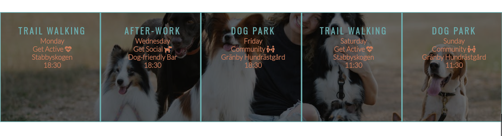

- Footer
    - The footer section, identical at the bottom of each page, display four different icons in the color theme. When clicked, they are working links to what would be the Club's Facebook, Twitter, YouTube, and Instagram accounts.

- Images
    - When the navigation link titled Images is clicked, it leads to the page containing a responsive grid of inspirational photos.
    - The purpose of these photos is to ease the user by letting them know their experience of owning a shy dog is understood and shared by other people. It is also mean to inspire action to join the meet ups.

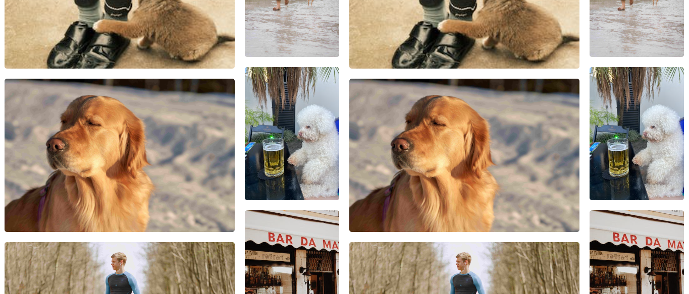

- Sign Up Form
    - When the navigation link titled Sign Up is clicked, it leads to the page containing the sign up form. 
    - The purpose of this form is to gather information on which meet ups the user is interested in joining.
    -The sign up form consists of:
        - A header, LET'S GET YOU SIGNED UP!
        - Three input boxes with labels for First Name, Last Name, and Email Address.
        - Three radio button options labeled Granby, Stabby, and Pub to indicate which meet up the user is interested in joining.
        - A Submit button with the text Get Social!

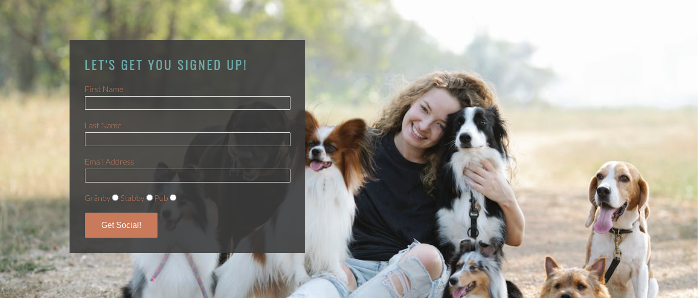

## Testing

### Bugs
- The loading time for the images page was very slow and received a poor score on the Lighthouse Performance. I resized and compressed the larger images and both the loading time and the Lighthouse score greatly improved.

### Validator Testing
- HTML
    - The html code was validated and cleared via [W3C HTML Validator](https://validator.w3.org/#validate_by_input).
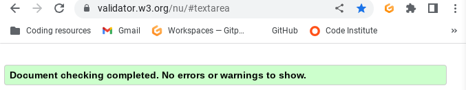
- CSS
    - The CSS code was validated and cleared via [W3C CSS Validator (Jigsaw)](https://jigsaw.w3.org/css-validator/).
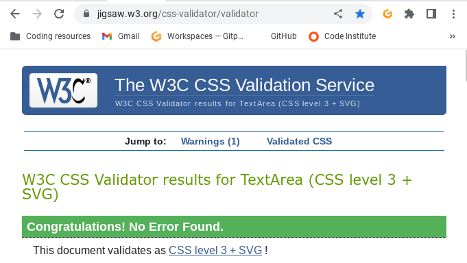    
- Accessibility
    - I confirmed that the color palette and fonts are easily accessible by using [Lighthouse](https://pagespeed.web.dev/report?url=https%3A%2F%2Fkrystalcoding.github.io%2Fantisocial-dog-meetups%2F&form_factor=desktop) in devtools.
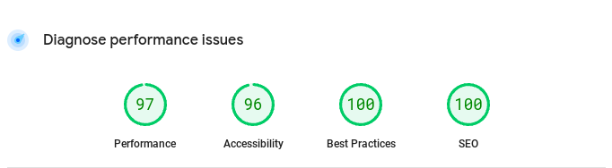

### Unfixed Bugs
- The loading time for the images page is still lagging slightly. Can be improved upon when I learn more in the Code Institute about this concept. For now, it should pass project requirements.

## Deployment
- The Club's Website was deployed using GitHub pages. The steps to deploy are the following:
    - From the [GitHub repository](https://github.com/KrystalCoding/antisocial-dog-meetups), navigate to the Settings tab.
    - On the left hand side, scroll down to the navigation link titled Pages.
    - From the branch source drop-down menu, select the option Master.
    - When the page was refreshed, the link for deployment was provided.
Once again, the live link can be found here: [Shy Dog Club](https://krystalcoding.github.io/antisocial-dog-meetups/).

## Credit

### Content
- The code to design the logistics section, format the sign-up section, and make social media connections was taken from the CI [Love Running](https://github.com/KrystalCoding/love-running) Project with tutorial videos by [The Code Institute](https://codeinstitute.net). Assistance from tutors at the Institute was also utilized for image responsiveness.
- Resource [W3 Schools](https://www.w3schools.com/howto/howto_css_image_grid_responsive.asp) was used in creating a responsive image grid.
- [GitHub](https://docs.github.com/en/get-started/writing-on-github/getting-started-with-writing-and-formatting-on-github/basic-writing-and-formatting-syntax#images) provided the basic writing and syntax used in this README.md file.

### Media
- The images were all borrowed from [Pexels](https://www.pexels.com/).
- The icons were borrowed from [Font Awesome](https://fontawesome.com/start).
